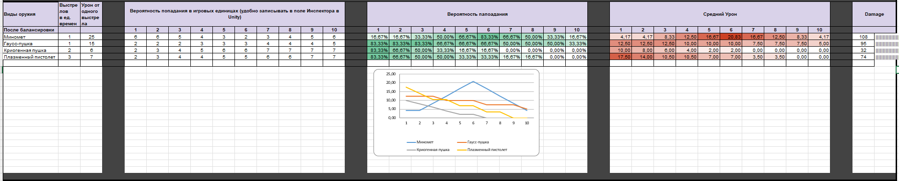

# АНАЛИЗ ДАННЫХ И ИСКУССТВЕННЫЙ ИНТЕЛЛЕКТ [in GameDev]
Отчет по лабораторной работе #3 выполнил(а):
- Ежова Алиса Дмитриевна
- РИ-230932
Отметка о выполнении заданий (заполняется студентом):

| Задание | Выполнение | Баллы |
| ------ | ------ | ------ |
| Задание 1 | * | 60 |
| Задание 2 | * | 20 |
| Задание 3 | * | 20 |

знак "*" - задание выполнено; знак "#" - задание не выполнено;

Работу проверили:
- к.т.н., доцент Денисов Д.В.
- к.э.н., доцент Панов М.А.
- ст. преп., Фадеев В.О.

Структура отчета

- Данные о работе: название работы, фио, группа, выполненные задания.
- Цель работы.
- Задание 1.
- Код реализации выполнения задания. Визуализация результатов выполнения (если применимо).
- Задание 2.
- Код реализации выполнения задания. Визуализация результатов выполнения (если применимо).
- Задание 3.
- Код реализации выполнения задания. Визуализация результатов выполнения (если применимо).
- Выводы.
- ✨Magic ✨

## Цель работы
Сделать все 3 задания.

## Задание 1
### Расширьте варианты доступного оружия в игре. Используйте шаблон таблицы для визуализации оружия игры Save RTF.

(https://docs.google.com/spreadsheets/d/1dl3iOEY1x2wD8T6H7Kn9wnDpOi1mmBKU2D4IDS3HzKY/edit?usp=sharing)

[Week#3 - Баланс в играх.xlsx](file xlxs link git)

## Задание 2
### Визуализируйте параметры оружия в таблице.Используйте шаблон таблицы для визуализации оружия игры Save RTF. Постройте примеры для следующих математических величин (см. пример в презентации):

# Среднеквадратическое отклонение (СКО)

# Разброс урона оружия

# Вариативность времени отклика игрока (реакция на события)

## Задание 3
### Решение в 80+ баллов должно визуализировать данные из google-таблицы, и с помощью Python передавать переменные в проект Unity. В Python данные также должны быть визуализированы.

## Выводы

Научлися делать 
1.Вариативность времени отклика игрока, Разброс урона оружия, Среднеквадратическое отклонение.
2.Освоила работу с таблицами через Python, научилась интегрировать их в Unity и настраивать взаимодействие.

## Powered by

**BigDigital Team: Denisov | Fadeev | Panov**
